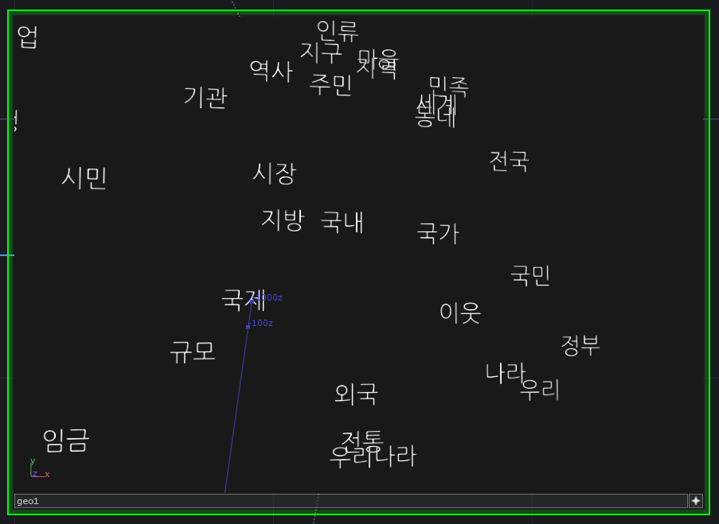

[//]: # (For development of this README.md, use http://markdownlivepreview.com/)

# fastText-for-language-learners
A foreign language study methodology based on [fastText](https://github.com/facebookresearch/fastText) and [Spaced Repetition Learning](https://en.wikipedia.org/wiki/Spaced_repetition)

# Backstory
Back in 2014, I started learning Korean. I happened to read this [advice](https://blog.fluent-forever.com/base-vocabulary-list/) about vocabulary lists (skip to **"A quick note about order"**).

> Order is important. In language classes, you’ll typically learn words in thematic order because it’s a comfortable way to organize classes (“Today, we’re going to learn about animals!”) and it’s a comfortable way to learn (“Today, I learned about animals!”). But there’s an unintended consequence of doing this: you get your words mixed up. I learned all of my French numbers and colors at the same time, and I still have problems remembering whether sept is six or seven, or whether jaune is yellow or green. This is borne out by the research: when you learn a bunch of similar words at once, you’ll have a harder time remembering which one is which. The opposite is also true: when you learn a bunch of totally unrelated words at once (dog, apple, red, skyscraper, president), you’ll have an easier time remembering those words.

This thought has been in the back of my head for years as I've continued to learn Korean. Part of my process included learning the 1000 most commonly used Korean words with an index card memorizing app called [Anki](https://apps.ankiweb.net/). Anki is a spaced repetition system for learning just about anything, but it's perfectly suited for vocabulary. Ideally, one side of the index card is an image and the other side is the word in the target language. You can set up Anki to learn in one direction or both. So you see the image and are asked for the language's spelling, or you see the spelling and are asked for producing the mental image.

I learned the 1000 most common words starting with the absolutely most common and ending on the less common. This strategy has strengths and weaknesses. It would be an unfortunate coincidence if the list had the words for yellow (노랗다) and blue (파랗다) close to each other. Each word ends in ~랗다, which has no meaning on its own. I actually think I learned these words on the same day due to a textbook teaching too many colors at once. I wish I had learned them less close together, which would have been less confusing. Then when I learned the second word, I would have thought, "Oh what a fun coincidence that they're similar."

As I continued my studying over several years, I built up a list of words I had not yet fully learned. A lot of them were abstract, which made it difficult to pair them with an image from Google Images and put in my Anki deck.

Finally as a New Year's Resolution for the year of 2019, I decided to try increasing my vocabulary with a learning experiment. I cleaned up my list of around 4000 semi-learned words and exported it as a comma-separated list. The first column was the Korean word and the second was the definition written in English or Korean.

Next, I compiled Facebook's [fastText](https://fasttext.cc/) project for my Windows PC. The gist of fastText is that as input it takes a huge body of text, such as all of Wikipedia written in any of its languages. FastText then "trains" on this [data](https://fasttext.cc/docs/en/crawl-vectors.html). The result is a mathematical model that can assign a vector of 300 numbers to any word in the language even if the word never appeared in the training data. This is *great* for Korean because there are so many conjugations of words that some may never even appear in Wikipedia. I laughed at this viral image demonstrating the intimidating amount of conjugations of "To Not Know."

Korean speakers also invent new words very frequently. If a new word is invented, we want our system to "guess" accurately what it means or at least how it fits in the context of other words.

The 300 numbers that each word can receive do just that. Pardon my [hand-waving](https://en.wikipedia.org/wiki/Hand-waving#In_mathematics_(and_formal_logic,_philosophy,_theoretical_science)), but my explanation is that they sum up the meaning of the word. [Word2Vec](https://en.wikipedia.org/wiki/Word2vec) has good background info. The problem is that a list of 300 numbers is too much for us mere 3D-humans to understand. We need to reduce the dimensionality to something smaller, like two-dimensions, and plot the data on a grid.

Fortunately, there are two easy to use techniques for dimensional reduction. One is [t-SNE](https://scikit-learn.org/stable/modules/generated/sklearn.manifold.TSNE.html) and the second is [UMAP](https://github.com/lmcinnes/umap).

With UMAP I was able to reduce each vector of 300 numbers to a vector of two numbers. The result of this reduction is called an "embedding." To recap, I now had 4000 pairs of numbers, and each pair corresponded to a Korean word I wanted to learn.

Next, I needed to decide in what order I would learn the words. Thinking back to my confusion of colors, I decided that I wanted to try to keep learning words of maximally different subject matter. I thought how I would solve the problem visually. Imagine laying out the 4000 words in 2D-space according to their two number "embedding". Pick any word to learn first. Next, pick the word that's farthest away. Then pick the word that's farthest away from the two already picked words. Keep picking words that are maximally far away from all previously picked words until no more words are left to pick. The algorithm is bad in terms of its memory usage and its [time complexity](https://en.wikipedia.org/wiki/Time_complexity), but what matters is that it's easy to understand and it works. One optimization is that you don't need to compare to ALL of the previously picked words, maybe just the N-most-recently picked words.

Thus I had my list of 4000 Korean words/definitions in the order I wanted to learn them. I ran the same experiment on words I already knew, the 1000 most common words. These are some fun observations.

First of all, the UMAP aspect of the algorithm succeeded. Words that are similar in subject matter are definitely close to each other. The rest of my sorting algorithm is premised entirely on this assumption.

Second, antonyms often get placed in clusters, which is good. 작다, 크다, 깊다, 적다, 높다, 낮다, 넓다 appear nearby. Those words mean small, big, deep, few, high, low, and wide. My vocabulary sorting algorithm will visit this cluster once, pick a word, and then need to wait a long time before coming back for another. I'd be less likely to confuse 작다 and 적다 for example. Don't they look similar? 작다 is "small" and 적다 is "few (not many)". I bet lots of Korean learners learn these within a week of each other and struggle.

The words for 대통령, 선거, and 정치, appear near each other. These words mean President, election, and politics. Also nearby is 문, which means "Door." Door is one of the 1000 most common words, but the reason it appears next to political words is because 문 is the surname of Korea's current [President](https://en.wikipedia.org/wiki/Moon_Jae-in). His 문 surname almost certainly means "writing." "Door" is a possible, but incorrect, interpretation. Perhaps if someone else were President, "Door" would appear closer to words like "entrance" or "exit."

The words for 오늘, 오후, 밤, 저녁, 아침, and 식사 appear in a cluster. These words mean today, afternoon, night, evening, morning, and...meal. Doesn't "meal" appear to be an outlier? Korean speakers know this is a trick question because 저녁 and 아침 can *also* mean meal. An awkward translation of the Korean way of asking "Did you eat breakfast?" is "Did you eat the morning?" Likewise, "Did you eat dinner?" would be incorrectly translated as "Did you eat the evening?"

The seasons of the year appear in a cluster. Textbooks often teach spring, summer, fall, and winter at once, but obviously you don't need to learn the four seasons at once. Live day by day!

The words for 우리 and 나라 appear next to each other. These words mean We and Country. Because of the word "We", you might expect the words for "I", "You", and "They" to be near, but *they* are not. :3 The reason is that putting 우리 and 나라 next to each other (우리나라) means South Korea. "We"+"Country"="Our Country"="South Korea". When Koreans talk about their own country, they often literally say "Our Country." 

By the way, nearby words to this cluster are 외국, 국제, 국내, 국민, 국가, 전국. Can you spot the similarity? The syllable 국 appears in all of them! [국](https://en.wiktionary.org/wiki/%E5%9C%8B#Korean) as a root-word means country, and therefore appears as a syllable in these words: foreign, international, domestic, country-person, country, nationwide. This kind of thing is very common in Korean because so many words are of [Chinese origin](https://en.wikipedia.org/wiki/Sino-Korean_vocabulary). In English the word for photosynthesis combines the Greek φῶς, phōs, "light", and σύνθεσις, synthesis, "putting together." Likewise in Korean, photosynthesis (광합성) is the combination of 광, light with 합, together, and 성, process. Fortunately, each syllable in that word rather consistently means the same thing in other words. So if I encounter 광 somewhere else, I first consider whether it might mean "light."

# Conclusion

This Github repository contains `unsorted_queries.csv` and `sorted_queries.csv` Each contains the 1000 most common Korean words, but there are some duplicates since I just ripped the list from [https://1000mostcommonwords.com/1000-most-common-korean-words/](https://1000mostcommonwords.com/1000-most-common-korean-words/). The sorted list has been sorted with the method I described earlier. If you're going to study Korean, perhaps consider learning the words in this order. I learned my list of intermediate/advanced 4000 words with this methodology, and it worked very well for me!

# Reproducing the files

If you wish to examine the code that led to those files, it's just a few steps:

Install fastText. On Windows you might want to use pre-compiled wheel files: [https://github.com/ageitgey/fastText-windows-binaries/releases/tag/v0.9.1](https://github.com/ageitgey/fastText-windows-binaries/releases/tag/v0.9.1)

Download the very large Korean fastText model. It's the "bin" link near Korean on this [page](https://github.com/facebookresearch/fastText/blob/master/docs/crawl-vectors.md). You should end up with a 7 GB file named "cc.ko.300.bin" in the folder of this Github project.

On Windows, run `run_fastText.bat` or on Mac run `run_fastText.sh`. That script takes the file `queries.txt` and produces `output.txt`.

Next install Python 3, NumPy and [UMAP](https://github.com/lmcinnes/umap). If you already have Python, then
`pip install numpy umap-learn`

Then run:
`python reduce_and_sort.py`

That will create `unsorted_queries.csv` and `sorted_queries.csv`

If you want to analyze the clusters of words yourself, I would recommend installing [TouchDesigner](https://derivative.ca/download) and using the project in this repository. You'll need build version of TouchDesigner that's 30000 or higher. But don't worry, TouchDesigner is free!

Happy language learning!
